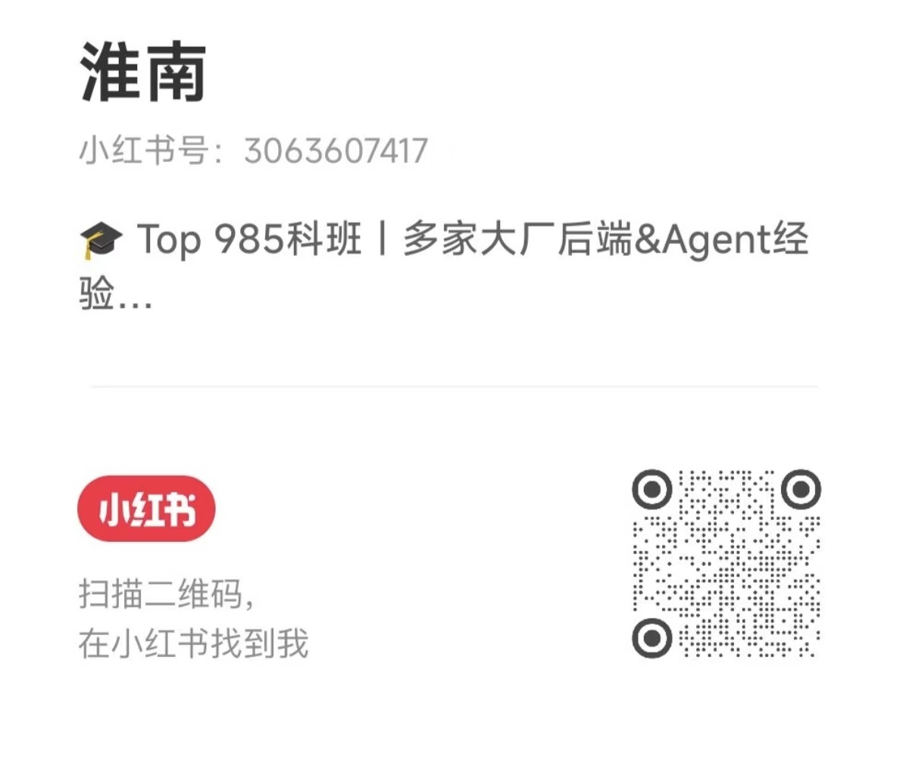

# Ecom-Service-Agent: 从0到1实战企业级电商客服Agent系统

## 背景

大家好，我是淮南，Top 985科班出身，有多家大厂后端 & AI Agent 研发经验。

我在小红书上运营着一个 **AI Agent 面经系列**，分享了我面试字节、阿里、MiniMax 等多家公司 AI Agent 岗位的真实面经，目前已经积累了 5000+ 粉丝。在和大家交流的过程中，我发现很多同学对 Agent 相关技术很感兴趣，但苦于没有一个**完整的、可跟着动手的实战项目**。

所以我决定做这件事 —— **以电商客服为场景，从0到1带大家实战一个企业级 Agent 系统**。

### 为什么选电商客服？

电商客服是 Agent 最经典的落地场景之一：业务逻辑清晰（查订单、退换货、推荐商品、售后处理），大家容易理解，面试中也经常被问到。做完这个项目，你不仅能掌握 Agent 核心技术栈，还能直接写进简历。

### 更新方式

我会在小红书上**每期更新一个 Agent 相关技术**，对应本仓库的一个 commit / tag。特别复杂的技术点会拆成 2 期。你可以跟着每期笔记，checkout 到对应的 tag，一步一步跟着做。

**扫码关注我的小红书，获取每期更新通知：**

<p align="center">
  
</p>

### 技术演进路线（更新预告）

本项目会按照由浅入深的节奏，逐步叠加 Agent 相关技术：

**基础篇**
- 纯 Prompt 实现客服对话
- 结构化输出（Structured Output）
- 多轮对话管理

**进阶篇**
- ReAct 范式的 Agent（思考-行动交替，最经典的 Agent 范式）
- 工具调用 / Function Calling（查订单、查库存等）
- MCP（Model Context Protocol）集成
- RAG 检索增强生成（接入商品库、FAQ、退换货政策等）

**高级篇**
- Plan-and-Execute（先规划再执行，适合复杂多步骤请求）
- Reflexion 反思机制（自我评估与迭代改进）
- REWOO（预规划 + 批量执行，高效处理并行任务）
- Memory：短期记忆 & 长期记忆
- Skill：可复用的能力模块（退货处理、订单跟踪等标准化流程）
- Multi-Agent 协作（客服路由、售前售后分流）
- Agent 评估体系

> 以上为初步规划，实际更新可能会根据大家的反馈进行调整。

---

## 项目架构 & 更新历史

> 这是本项目最核心的部分，会随着每一期的更新持续完善。

### 当前架构

```
ecom-service-agent/
├── README.md
└── (即将更新...)
```

### 更新日志

| 期数 | 主题 | Tag | 日期 | 小红书笔记 |
|------|------|-----|------|------------|
| - | 项目初始化 | - | 2025-04-14 | - |

> 每期更新后，这里会同步更新架构图和更新日志。

---

## 求职辅导

我目前也在做 **AI 方向的求职辅导**，服务内容包括：

- 简历精修（针对 AI / Agent 岗位优化）
- 项目包装（帮你把项目经历讲出亮点）
- 模拟面试（还原大厂真实面试流程）
- 全程陪跑（从投递到拿 offer）

有需要的同学可以添加我的微信：**HuaiNan54321**，备注「求职辅导」。
